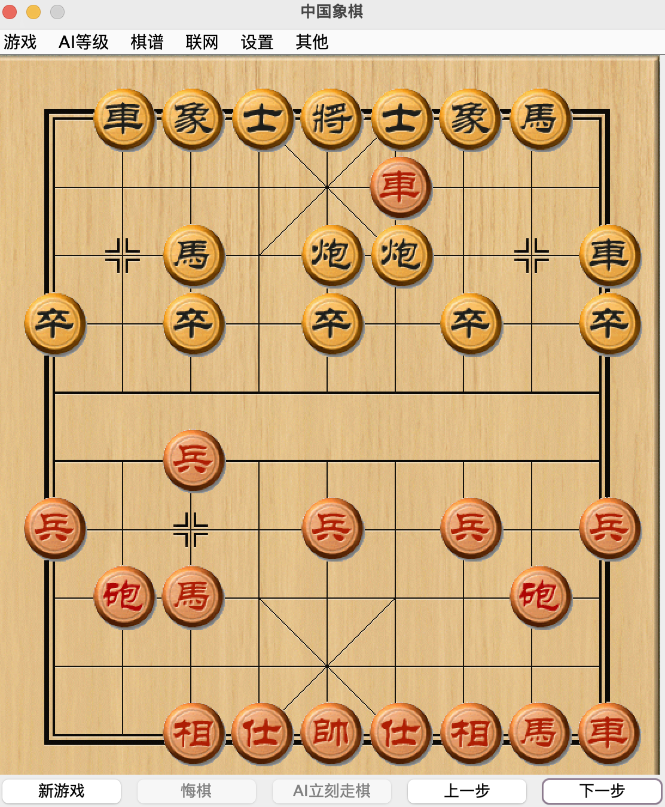
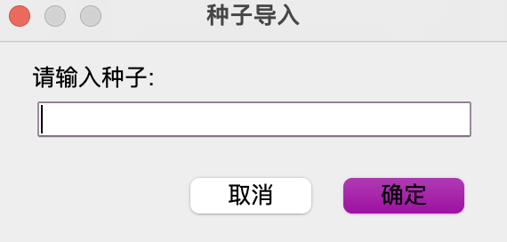

# 中国象棋: 一个由AI赋能的象棋Java程序

一.**程序一览**

<div>

<figure><figcaption><p>棋谱</p></figcaption></figure>

 

<figure><figcaption><p>主界面</p></figcaption></figure>

 

<figure><figcaption><p>种子导入界面</p></figcaption></figure>

</div>


二.最新发布

正式版: [Github](https://github.com/TalexCK/ChineseChess/releases/tag/0.1-beta)\
[JAR from release](https://github.com/TalexCK/ChineseChess/releases/download/0.1-beta/ChineseChess-0.1-beta.jar)\
[JAR from repository](https://github.com/TalexCK/ChineseChessDownload/raw/master/ChineseChess-0.1-beta.jar)\
[Action Build](https://github.com/TalexCK/ChineseChess/actions/runs/5304192680)\
版本:0.1-beta\
更新时间:2023.06.18\
更新内容:\
1.配置文件更新\
2.添加AI对战AI的功能\
3.优化版本信息

Bug Fixes:\
1.修复棋谱记录不删除错误\
2.修复棋谱可以无限进行 下一步 的错误\
3.修复棋谱可以无限进行'上一步'的错误\
4.修复棋谱无法进行'下一步'的错误

测试版: [Github](https://github.com/TalexCK/ChineseChess/releases/tag/0.0.2.4-alpha)\
[JAR from release](https://github.com/TalexCK/ChineseChess/releases/download/0.0.2.4-alpha/ChineseChess-0.0.24jar)\
[JAR from repository](https://github.com/TalexCK/ChineseChessDownload/raw/master/ChineseChess-0.0.2.4.jar) **(Suggest)**\
版本:0.0.2.4\
更新时间:2023.06.18\
更新内容:\
1.配置文件系统更新

错误修复:


三.所有更新

1.增加AI运算与后台思考的输出界面\
2.增加报错输出界面与日志输出界面\
3.取消HASH表的选项\
4.由"切换电脑方"选项替换"电脑红方"选项、"电脑黑方"选项\
5.增加"双人对战"选项\
6.导入功能从打开弹出对话框改到"游戏"菜单内选项\
7.增加"种子"概念，增加"种子导入""种子导出"功能，可以由一条文本导入和导出对局\
8.悔棋会多悔棋一步，在与电脑对战时方便很多\
9.以下行为将会被日志记录:\
(1)打开软件\
(2)悔棋\
(3)导出种子\
(4)导入种子\
(5)游戏结束\
(6)后台思考的切换\
(7)音效的切换\
(8)程序错误\
10.以下行为将会被AI运算输出:\
(1)AI走子运算\
(2)后台思考运算\
**11.增加棋谱功能，可以导入与导出**


**四.运行**

下载源代码自行构建/运行(启动类com.pj.chess.ChessBoardMain)\
或使用构建好的文件\
**运行请务必使用命令行(windows)/终端(macos)，否则可能无法使用完整功能**

```
java -Xmx1g -jar ChineseChess.jar  
```

Mac系统可以自行构建一个快捷程序以快速启动


五.其他

Forked from pengjiu/ChineseChess [Github](https://github.com/pengjiu/ChineseChess)
